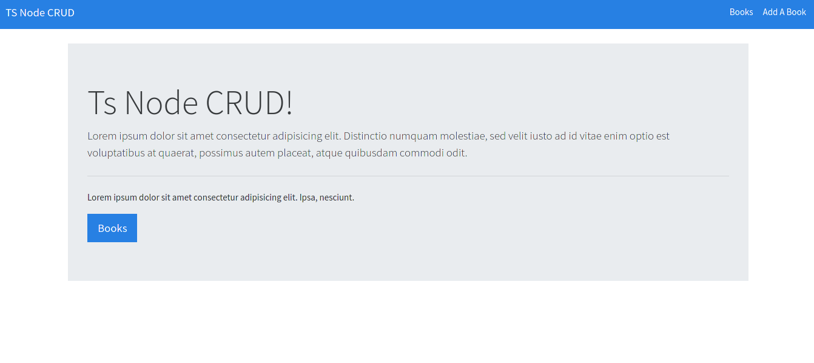
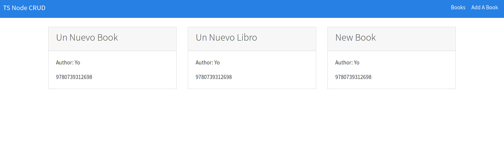
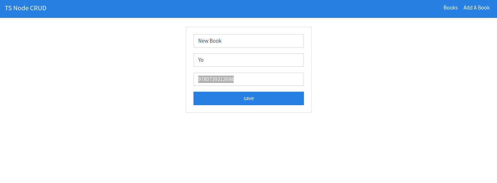
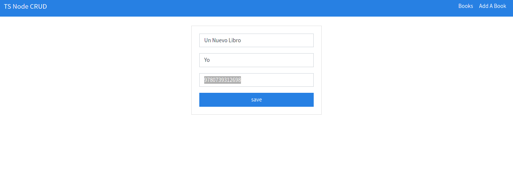
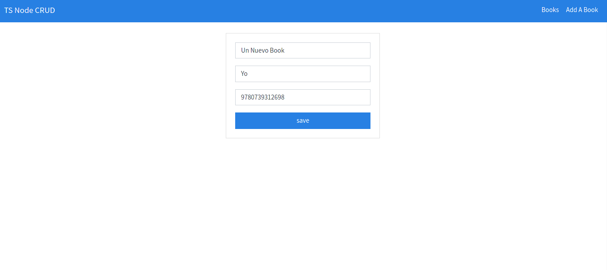

# FIRST PROJECT WITH TYPESCRIPT :rocket:

This is my first project using TS.

## Technologies used for this project :computer:

- [typescript](https://www.typescriptlang.org/)
- [nodejs](https://nodejs.org/en/)
- [mongodb](https://nodejs.org/en/)

## Screenshots :camera:











## Usage

> The database (mongo) must be have running at port 27017 (default port)

```cmd
git clone https://github.com/gabrielba15/typescript-nodejs-mongodb-books-app.git 
cd typescript-nodejs-mongodb-books-app
npm install 
npm run build 
npm start
```

> Ready, happy hacking :D.
